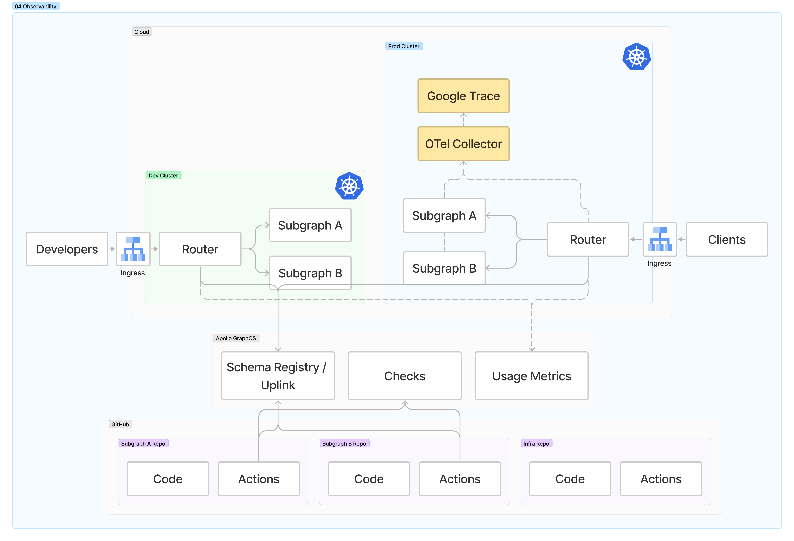

# 04 - Observability

⏱ Estimated time: 5 minutes

## What you'll build



## Part A: Setup Open Telemetry

Run the "Deploy Open Telemetry Collector" Github workflow to provisions the necessary resources your `prod` cluster:

```sh
gh workflow run "Deploy Open Telemetry Collector" --repo $GITHUB_ORG/apollo-supergraph-k8s-infra
```

The router and subgraphs are already configured to send Open Telemetry traces to the collector, which is configured to send traces to Google Trace.

## Part B: Demonstrate traces and metrics

Make a GraphQL request to the router via its IP address. 

### GCP

```sh
kubectx apollo-supergraph-k8s-prod
ROUTER_IP=$(kubectl get ingress -n router -o jsonpath="{.*.*.status.loadBalancer.ingress.*.ip}")
open http://$ROUTER_IP
kubectl port-forward -n zipkin svc/zipkin 9411:9411
```

Lastly, open up [http://localhost:9411/](http://localhost:9411/) in addition to the Router page. Upon doing so, you'll have both the Router and Zipkin pages open. Run a few requests and refresh the Zipkin list, and you should be seeing them come through! 

### AWS

```sh
kubectx apollo-supergraph-k8s-prod
ROUTER_IP=$(kubectl get ingress -n router -o jsonpath="{.*.*.status.loadBalancer.ingress.*.hostname}")
open http://$ROUTER_IP
kubectl port-forward -n zipkin svc/zipkin 9411:9411
open http://localhost:9411
```

Lastly, open up [http://localhost:9411/](http://localhost:9411/) in addition to the Router page. Upon doing so, you'll have both the Router and Zipkin pages open. Run a few requests and refresh the Zipkin list, and you should be seeing them come through! 

## Onward!

[Step 5: Load Testing](../05-load-testing/)
